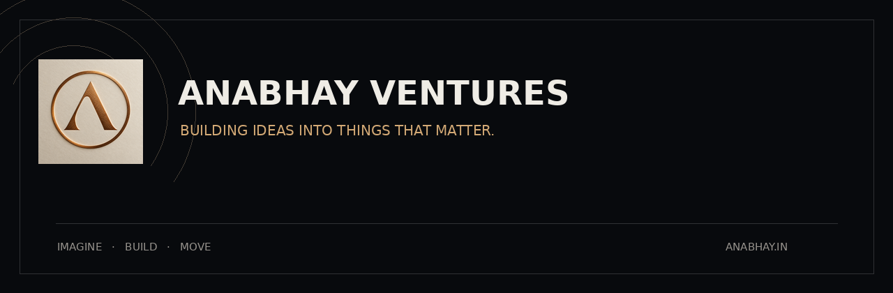

<div align="center">

<a href="https://anabhay.in">
  
</a>

# ANABHAY VENTURES

### Building ideas into things that matter.

**Technology · Products · Research · Ventures**

[Website](https://anabhay.in/) · [GitHub](https://github.com/ANABHAY-VENTURES)

</div>

---

## What we do

ANABHAY VENTURES is a venture-building organization focused on turning meaningful problems into practical technology, products, and independent ventures.

We explore problems, build working systems, test what we make, and move promising ideas forward.

Our work can begin as a prototype, a research project, or a small experiment. When an idea proves worth pursuing, we build it further.

---

## Selected work

### ◈ Ekadantaa

**Cognitive Mobility Platform**

An assistive mobility project exploring multimodal control, embedded systems, biosignals, wireless communication, and intelligent safety mechanisms.

`Embedded Systems` `Biosignals` `Bluetooth` `Mobility`

---

### ◈ CivicSync

**Civic Technology**

A civic technology platform designed to turn citizen-reported problems into structured, trackable workflows connecting people, issues, and civic authorities.

`Web` `Civic Technology` `APIs` `Systems`

---

### ◈ GradeWise

**Academic Technology**

A university-aware academic utility designed to simplify grade, SGPA, and CGPA calculations across different academic rules and grading systems.

`Web` `Education` `Data`

---

### ◈ Hastavya

**Heritage Craft & Commerce**

A venture exploring how traditional handmade products and heritage craftsmanship can reach modern digital markets while keeping the craft at the centre.

`Craft` `Commerce` `Heritage`

> **Selected work represents projects and initiatives associated with the organization and its contributors. Organizational ownership, incorporation, or formal venture status may vary by project.**

---

## How we build

```text
PROBLEM
   ↓
EXPLORE
   ↓
PROTOTYPE
   ↓
BUILD
   ↓
TEST
   ↓
REFINE
   ↓
MOVE FORWARD
```

We don't build simply to add another project to a portfolio.

We build to understand a problem deeply enough to create something useful.

---

## Principles

**Problem before technology.**  
Start with the problem, not the trend.

**Build before claiming.**  
Ideas become meaningful when they survive contact with reality.

**Keep learning.**  
Every prototype is an opportunity to understand something better.

**Move deliberately.**  
Not every experiment needs to become a company. The ones that deserve to continue should be given room to grow.

---

## Explore

🌐 **Website** — https://anabhay.in/  
💻 **Organization** — https://github.com/ANABHAY-VENTURES

---

<div align="center">

**IMAGINE. BUILD. MOVE.**

© ANABHAY VENTURES

</div>
